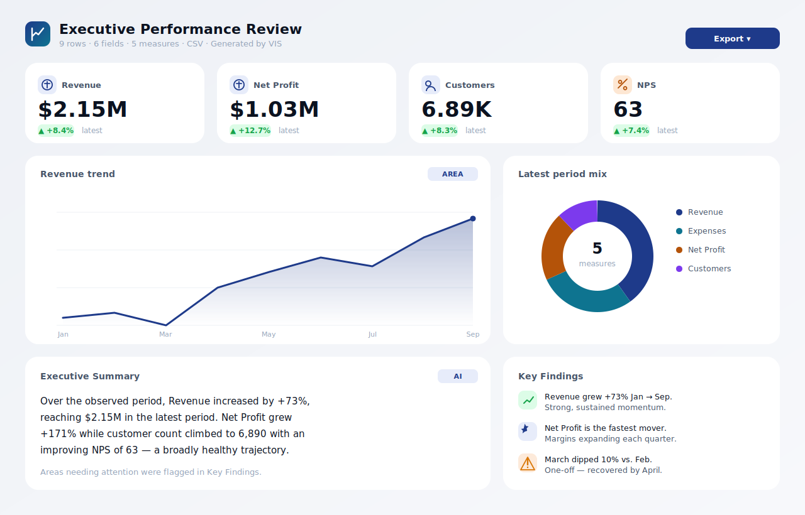

<div align="center">

# VIS · Visual Intelligence Studio

### Paste your data. Get a boardroom-ready dashboard in seconds.

VIS turns raw business data into a beautiful, executive-ready dashboard — complete with the right charts, key metrics, and a written summary — **automatically**. No spreadsheets to wrangle, no chart wizards, no design work.

<br/>



<sub>An example dashboard generated by VIS from a simple monthly revenue table.</sub>

</div>

---

## What is VIS?

VIS (Visual Intelligence Studio) is a tool for **anyone who needs to present numbers** — founders, analysts, finance and PMO leads, HR, sales managers.

You paste in a table of data. VIS reads it, understands what the columns mean, decides which charts tell the story best, calculates the headline metrics, writes a short executive summary, and lays it all out as a polished dashboard you can present or export.

Think of it as an **analyst + designer that works instantly**.

## How it helps you

| Without VIS | With VIS |
|---|---|
| Copy numbers into a spreadsheet, build charts one by one | Paste once, get a full dashboard automatically |
| Guess which chart fits the data | The right chart is chosen for you |
| Manually calculate totals, growth %, and averages | KPIs and trends computed instantly |
| Write the "what does this mean" summary yourself | A summary, key findings & recommendations are drafted for you |
| Fiddle with colours and spacing | 14 premium themes, light & dark, always presentation-ready |
| Screenshot and paste into slides | One-click export to PNG, PDF or print |

## What you get in every dashboard

- **Headline KPIs** — the most important numbers, with growth arrows (▲ / ▼) versus the previous period.
- **The right charts** — trend lines, bar and ranking charts, donut/share breakdowns, comparisons and more, picked based on your data.
- **Executive summary** — a clear, written paragraph explaining what the data shows.
- **Key findings** — the wins, the risks, and any unusual outliers, flagged automatically.
- **Recommendations** — suggested next steps.
- **Source table** — your original data, cleanly formatted.

## More ways to work

- **💬 AI Assistant** — a chat panel (bottom-right). Tell it what you want: *"make it look like Apple"*, *"dark mode"*, *"reduce charts"*, *"build a presentation"*, *"summarize"*. Connect your own AI model and it can also answer questions about your data.
- **📊 Presentation mode** — turn any dashboard into executive **slides** (title → metrics → each chart → summary → recommendations). Navigate with arrow keys, present fullscreen, or export to PDF/PowerPoint.
- **🖼️ Infographic mode** — a tall, poster-style single image, perfect for sharing. Export to PNG.
- **✏️ Editor** — flip on **Edit** to drag-reorder cards, resize them, duplicate or delete — with full **undo/redo**.
- **🕘 History & Workspace** — every dashboard you generate is saved automatically (in your browser). Reopen any of them with one click.
- **⬇️ Export anywhere** — PNG, SVG, PDF, PowerPoint (.pptx), standalone HTML, JSON, or print.
- **🎨 Rich visuals** — line, area, bar, ranking, donut, scatter, bubble, radar, gauge, stacked, waterfall and treemap charts — chosen automatically to fit your data.

## How to use it

1. **Open VIS** and go to the **Studio**.
2. **Paste your data.** It accepts almost anything:
   - A table copied straight from **Excel or Google Sheets**
   - **CSV** or **JSON**
   - A **Markdown table**
3. Click **Generate**. Your dashboard appears instantly.
4. Pick a **theme** (Apple, Stripe, Finance, Executive, and more) and toggle **light/dark** to taste.
5. **Export** as PNG, SVG, PDF, PowerPoint, HTML, JSON, or print — ready to drop into a deck or email.

> Tip: In a hurry? Open the app and click a **sample** (Executive, Finance, Sales, HR, PMO) to see a full dashboard immediately.

**Example — paste this and hit Generate:**

```
Month, Revenue, Expenses, Customers
Jan, 42000, 31000, 120
Feb, 51000, 33000, 148
Mar, 60000, 35000, 171
Apr, 58000, 36000, 180
May, 72000, 38000, 205
Jun, 81000, 40000, 240
```

## Architecture

VIS ships as a **frontend + backend**:

- **`public/`** — the frontend (static HTML/CSS/JS). Works on its own for personal/demo use.
- **`server/`** — a small **Node.js backend with zero npm dependencies** (standard library only). It serves the frontend, keeps the AI API key **server-side**, proxies AI requests, and powers the admin portal.

## Team deployment (recommended)

Run the backend so your whole team shares one securely-managed AI key.

```bash
# 1) (optional, for offline/internal networks) vendor the browser libraries once
#    on a machine with internet, so nothing loads from a public CDN:
bash scripts/fetch-vendor.sh        # or: npm run fetch-vendor

# 2) start the server (no install needed — zero dependencies)
VIS_ADMIN_TOKEN="choose-a-strong-token" npm start
#   → app:   http://localhost:4000
#   → admin: http://localhost:4000/admin
```

Or with Docker:

```bash
docker build -t vis .
docker run -p 4000:4000 -e VIS_ADMIN_TOKEN="choose-a-strong-token" vis
```

Environment variables (all optional): `PORT`, `VIS_ADMIN_TOKEN`, `VIS_AI_ENDPOINT`, `VIS_AI_KEY`, `VIS_AI_MODEL`.

### Admin portal

Go to **`/admin`**, sign in with the admin token, and you can:

- **Enable AI** and set the **endpoint, model, and API key** — the key is stored on the server (`server/config.json`) and **never sent to teammates' browsers**. All AI calls are proxied through `/api/ai/proxy`.
- Set **team defaults & branding** — app title, default theme, light/dark.
- **Change the admin token**, or lock it via the `VIS_ADMIN_TOKEN` environment variable.
- **Test the connection** to your AI provider with one click.

Teammates just open the app — AI features light up automatically, with no keys to configure. When AI isn't reachable, VIS falls back to its built-in analysis engine.

## Static / personal mode (no backend)

You can also host just the `public/` folder on any static host (GitHub Pages, Vercel, S3…). In this mode there's no central key: each person can optionally add their own AI endpoint/key under **Settings → AI Provider** (stored only in their browser). A GitHub Pages workflow (`.github/workflows/deploy.yml`) and `vercel.json` are included for this.

## Offline / air-gapped

Run `scripts/fetch-vendor.sh` once (where internet is available) to download the chart/export libraries into `public/assets/vendor/`, then commit that folder. After that VIS makes **no external requests at all** — ideal for internal networks. Until vendored, it loads those libraries from a CDN as a fallback.

## Privacy

Your pasted data is analysed **in your browser**. It is only sent onward if AI is enabled — and then only to the AI endpoint your admin configured (via the backend proxy), or, in static mode, to the endpoint you set yourself.

---

<div align="center">
<sub>VIS · Visual Intelligence Studio — turn data into decisions.</sub>
</div>
